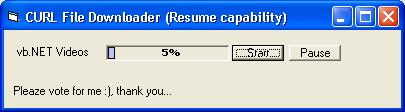



## File Downloader control using CURL \(Resume download supported\)

### Description

To show how to use cURL library for http file download and resume download.
 
### More Info
 

             |
---                |---
**Submitted On**   |2006-01-18 18:15:44
**By**             |[idzuan](https://github.com/Planet-Source-Code/PSCIndex/blob/master/ByAuthor/idzuan.md)
**Level**          |Intermediate
**User Rating**    |4.8 (29 globes from 6 users)
**Compatibility**  |VB 6\.0
**Category**       |[Internet/ HTML](https://github.com/Planet-Source-Code/PSCIndex/blob/master/ByCategory/internet-html__1-34.md)
**World**          |[Visual Basic](https://github.com/Planet-Source-Code/PSCIndex/blob/master/ByWorld/visual-basic.md)
**Archive File**   |[File\_Downl1966201182006\.zip](https://github.com/Planet-Source-Code/idzuan-file-downloader-control-using-curl-resume-download-supported__1-64077/archive/master.zip)

### Source Code

Good and stable HTTP library. File download is very fast. Various kind of HTTP methods included in the cURL library.

